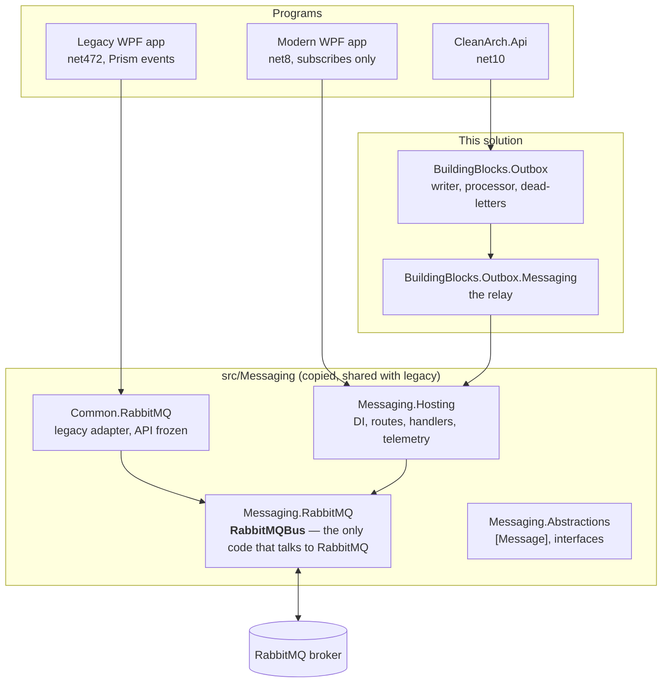
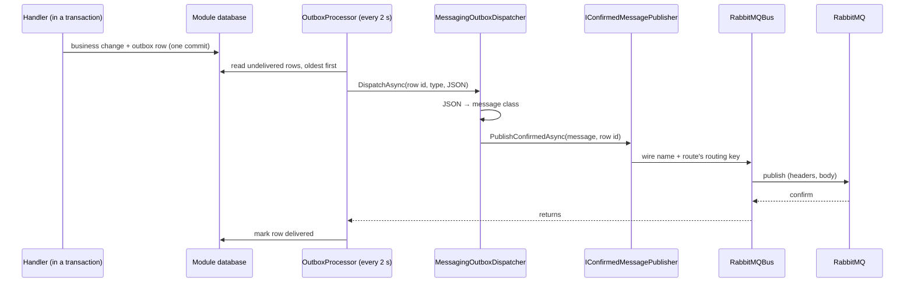

# Messaging with RabbitMQ

**Who this is for:** someone who needs the API to tell *other applications* that something
happened — a legacy WPF desktop app, a modern WPF app, another service — or who has to
maintain the messaging code and wants to know why it is shaped the way it is.

**What you'll be able to do by the end:** explain where RabbitMQ fits in this system and where
it doesn't, follow one event from a handler to a legacy desktop app, send a new event from a
module through its outbox, subscribe to events from a modern WPF app, keep legacy apps
working while you do it, and diagnose the usual failures.

**What you need first:** a feature that works ([guide 20](20-add-a-feature.md)), and the
outbox from [guide 60](60-talking-across-modules.md#4-why-a-multi-step-process-needs-the-outbox).
You don't need to know RabbitMQ; [chapter 3](#3-five-ideas-you-need) covers the parts you use.

> **Current state (2026-09-27).** The messaging library, the confirmed publish and the
> outbox-to-RabbitMQ relay are in the solution and tested, but **the API doesn't use them
> yet**: nothing calls `AddMessaging`, and no module sends an event to the broker. Chapters
> 8–12 are the steps to connect the first event, and their code is the proposed shape, not
> files you can open — `EquipmentRetired` and `IEquipmentOutbox` are illustrations. Everything
> else describes code that exists, with real paths.

---

## Table of contents

| # | Chapter | What you do there |
|---|---|---|
| 1 | [Where RabbitMQ fits, and where it doesn't](#1-where-rabbitmq-fits-and-where-it-doesnt) | Across processes, never between modules |
| 2 | [Three kinds of application, three sets of rules](#2-three-kinds-of-application-three-sets-of-rules) | Legacy, the API, modern WPF |
| 3 | [Five ideas you need](#3-five-ideas-you-need) | Just enough RabbitMQ |
| 4 | [The code map](#4-the-code-map) | Which project does what |
| 5 | [How an event leaves the API](#5-how-an-event-leaves-the-api) | Handler → outbox → broker, step by step |
| 6 | [What travels on the wire](#6-what-travels-on-the-wire) | The part that must never change |
| 7 | [When things go wrong](#7-when-things-go-wrong) | Outages, bad messages, duplicates |
| 8 | [Step 1 — Turn messaging on in the API](#8-step-1--turn-messaging-on-in-the-api) | Opt-in, from configuration |
| 9 | [Step 2 — Define the message](#9-step-2--define-the-message) | A plain class and a wire name |
| 10 | [Step 3 — Route it](#10-step-3--route-it) | Which bus, which routing key |
| 11 | [Step 4 — Send it through the module's outbox](#11-step-4--send-it-through-the-modules-outbox) | Two cases: a new outbox, or Onboarding's |
| 12 | [Step 5 — See it working](#12-step-5--see-it-working) | Telemetry, health, the management UI |
| 13 | [Receiving messages in the API](#13-receiving-messages-in-the-api) | Handlers, shared queues, retries |
| 14 | [Modern WPF apps: subscribe only](#14-modern-wpf-apps-subscribe-only) | `IMessageSubscriber` |
| 15 | [Legacy apps: what they keep](#15-legacy-apps-what-they-keep) | And how the API reaches them |
| 16 | [Testing](#16-testing) | What's covered, and how to test your own |
| 17 | [The traps](#17-the-traps) | Eight ways to lose an afternoon |
| 18 | [The checklist](#18-the-checklist) | Run this when doing it for real |
| 19 | [Troubleshooting](#19-troubleshooting) | Symptom, cause, fix |
| 20 | [Cheat sheet](#20-cheat-sheet) | The moving parts, in one place |
| 21 | [Glossary](#21-glossary) | Every term used in this guide |

---

## 1. Where RabbitMQ fits, and where it doesn't

RabbitMQ carries messages **between processes**: the API, the legacy desktop apps, the modern
desktop apps. It is a separate server (the *broker*); programs connect to it, hand it
messages, and receive the messages they asked for. Sender and receiver never talk directly,
and don't have to be running at the same time.

It is **not** how modules inside the API talk to each other. That stays exactly as
[guide 60](60-talking-across-modules.md) describes:

| Talking to… | How | Why |
|---|---|---|
| Another module, a read or simple action | A published contract, e.g. `IEquipmentReservationService` — a plain method call | Same process, same lifetime; nothing to go wrong in between |
| Another module, a multi-step process | The module's outbox, delivered in-process by its dispatcher | Durable across restarts without any extra infrastructure |
| **Another application** | **The module's outbox, delivered to RabbitMQ** | The other side is a different process, maybe on another machine |

Putting a broker between two modules of one process would add a network hop, a server to
run and a new way to fail, and buy nothing the outbox doesn't already give you.

---

## 2. Three kinds of application, three sets of rules

These rules are decisions, recorded in
[ADR 0003](../docs/messaging/adr/0003-server-publishes-through-the-outbox.md). They exist to
keep the system simple and to never break the desktop apps people use every day.

| | Legacy WPF apps (.NET Framework 4.7.2) | The API (and future services) | Modern WPF apps (.NET 8) |
|---|---|---|---|
| **Publishes?** | Yes, to each other, as today | Yes — **only through its outbox** | **No** |
| **Subscribes?** | Yes, as today | When it needs to ([chapter 13](#13-receiving-messages-in-the-api)) | Yes |
| **Library** | `Common.RabbitMQ` (the legacy adapter) | `Messaging.Hosting` + `BuildingBlocks.Outbox.Messaging` | `Messaging.Hosting` (`IMessageSubscriber`) |
| **If the app crashes with unsent messages** | Lost. Accepted: users live with it, and these apps will be retired | Nothing is lost: the event is a row in the database until the broker confirms it | Nothing to lose: they don't send |
| **What changes for them** | **Nothing.** Not the code, not the config, not the behaviour | New code goes here | New code goes here |

Two consequences run through the rest of this guide:

- Anything that would require a legacy app to change is off the table unless there is no other
  way — and then the *adapter* changes to match the legacy app, not the other way round.
- The API never "fires and forgets". If an event matters enough to send, it matters enough to
  survive a restart.

---

## 3. Five ideas you need

The messaging guide's [glossary](../docs/messaging/README.md#words-you-need-glossary) uses a
post-office analogy for every term. These five are the ones that shape the code.

### 1. Exchanges, queues and bindings

A program **publishes to an exchange** — a sorting desk that stores nothing. The exchange
copies each message into every **queue** whose **binding** matches, and programs **consume**
from queues. A binding says "copy messages with this routing key from that exchange into my
queue".

```
 API ──publish──▶ [exchange: AppA] ──binding "AppA.Events.OrderSaved"──▶ (queue of AppB, instance 1) ──▶ AppB
                                   ──binding "AppA.Events.OrderSaved"──▶ (queue of AppB, instance 2) ──▶ AppB
```

### 2. The wire name says *what*; the routing key says *where*

Every message carries its **wire name** in the `event-type` header — for example
`Common.Events.EmployeeUpdated`. Receivers identify a message by it, and by nothing else: not
the exchange, not the .NET type, not the assembly.

The **routing key** decides which bindings match. By default it *is* the wire name, which is
what legacy apps bind to.

Keeping the two apart is the single decision that lets legacy apps, modern apps and the API
share one system: routing can change without anyone misreading a message.

### 3. One exchange per application

Each application owns one exchange, named after it, and publishes only there. An app that
wants another app's events binds its own queue to the other app's exchange. Owners *declare*
their exchange; subscribers only *check* it exists (and wait if its owner hasn't started).

### 4. Two kinds of queue

| | Per-instance (desktop apps) | Shared (servers) |
|---|---|---|
| How many | One per running program | One per service, shared by all its instances |
| Who gets a message | Every running copy | One running copy |
| Lifetime | Deleted when the program exits | Durable, survives restarts |
| On a handler failure | Logged and dropped (legacy behaviour) | Retried, then parked in a dead-letter queue |

### 5. At least once

A message can arrive **twice**: the broker confirmed it, and the sender crashed before
recording that. The same is true of the outbox ([guide 60 §11](60-talking-across-modules.md#11-idempotency--two-strategies-and-a-third-you-might-need)).
Every receiver must tolerate a duplicate. Messages sent from the outbox keep the same
message-id every time they are sent, which makes duplicates easy to spot.

---

## 4. The code map

The messaging code was copied from its own repository, with the layout intact so legacy
projects can reference the adapter by the same relative path.
[PROVENANCE.md](../docs/messaging/PROVENANCE.md) records exactly what was copied and every
change since.



| Project | Target | What it is |
|---|---|---|
| `src/Messaging/Messaging.Abstractions` | net472, netstandard2.0, net8.0 | `[Message("…")]`, `IMessagePublisher`, `IMessageHandler<T>`, `MessageContext`. No dependencies — message classes reference only this. |
| `src/Messaging/Messaging.RabbitMQ` | net472, netstandard2.0, net8.0 | **The engine**, `RabbitMQBus`: connects, reconnects, declares, publishes, consumes, retries, dead-letters. |
| `src/Messaging/Messaging.Hosting` | net8.0 | Server-style setup: `AddMessaging`, routes, handlers, `IMessageSubscriber`, `IConfirmedMessagePublisher`, System.Text.Json, telemetry, health check. |
| `src/Messaging/Messaging.Prism` | net8.0 | Optional bridge for a .NET 8 app that wants to keep Prism's `IEventAggregator` style. |
| `src/Common.RabbitMQ` | net472, net8.0 | **The legacy adapter**: the old `PublishRemote` / `IRabbitMQService` API on top of the engine. Public API is additions-only. |
| `src/Common.RabbitMQ.Configuration` | net472, net8.0 | The legacy `<rabbitMQ>` App.config section. |
| `src/BuildingBlocks.Outbox.Messaging` | net10.0 | **The relay**: sends outbox rows to RabbitMQ with a confirmed publish. |
| `tests/Common.RabbitMQ.Tests` | net472, net8.0 | Golden wire bytes, the legacy public API, real-broker tests. |
| `tests/Fixtures/*` | | The frozen original library, a model of the real legacy library, and demo events the golden tests need. |

### Why the messaging folders build differently

The root `Directory.Build.props` turns on net10, nullable references, implicit usings and
warnings-as-errors, and the root `Directory.Packages.props` pins newer packages. None of that
may reach code that legacy .NET Framework apps load. So `src/Messaging/Directory.Build.props`
and `src/Messaging/Directory.Packages.props` hold the messaging settings — RabbitMQ.Client
**7.1.2**, Newtonsoft.Json **12.0.3**, Prism.Core **8.1.97**, the versions the legacy apps
use — and the other copied folders import them instead of the root files.

The practical rule: **don't add a package to the root props for messaging code, and don't
"tidy up" the messaging folders into the root settings.** See
[trap 17.8](#178-tidying-the-messaging-build-into-the-root-settings).

---

## 5. How an event leaves the API

This is the path once a module is connected (chapters 8–11). Every box is code that exists.



In plain words:

1. **The handler** changes its data and calls `Enqueue(new SomethingHappened(...))`. Both are
   saved in **one transaction** — so the event exists if and only if the change does.
2. **The outbox processor** polls every 2 seconds, takes up to 20 undelivered rows, oldest
   first, and hands each to the module's dispatcher.
3. **The relay** (`MessagingOutboxDispatcher`) turns the row back into its message class. The
   row stores the class's short name (`typeof(T).Name`) and its JSON.
4. **The confirmed publish** looks up the message's route, sends it to RabbitMQ **straight
   away**, and waits for the broker's confirm. The row's ID travels as the AMQP message-id.
5. **Only then** does the processor mark the row delivered. If the process stops at any point
   before that, the row is still there and goes out after the restart.

### Why not just call `IMessagePublisher.PublishAsync`?

Because `PublishAsync` returns as soon as the message is in an **in-memory buffer**; a
background loop sends it later. Legacy apps have always worked like that. For the outbox it
would be a quiet disaster: the processor would mark the row delivered while the message was
still in memory, a restart would lose it, and nothing would ever retry it — the outbox would
believe it had succeeded.

`PublishConfirmedAsync` buffers nothing. It either gets a broker confirm or throws, and the
row stays until it succeeds.

> **Legacy apps are unaffected.** They keep using the buffered path. The confirmed publish
> shares the same connection and channel safely because RabbitMQ.Client 7 serialises
> publishes per channel itself — the buffered path's code wasn't touched.

---

## 6. What travels on the wire

This is the contract with every other application. Tests pin it byte for byte against
**golden files**, and against a frozen copy of the original library.

| Part | Value | Who reads it |
|---|---|---|
| Routing key | The wire name, unless the route sets another | The broker's bindings |
| Header `event-type` | The wire name | Every receiver: this is how it knows what the message is |
| Header `source-id` | The sending process's random ID | Desktop apps, to skip their own messages |
| Header `x-dotnet-pub-seq-no` | Added by RabbitMQ.Client | Nobody |
| Headers `correlation-id`, `traceparent`, `tracestate` | Only with `.AddTelemetry()` | Tracing tools; old receivers ignore them |
| `message_id` | From the outbox: the row's ID. Otherwise a new GUID | Duplicate detection |
| `content_type` | `application/json` | |
| Body | The message object as JSON, exactly as Newtonsoft.Json 12 writes it with default settings | Every receiver |

The API writes JSON with System.Text.Json, configured to produce the same bytes as
Newtonsoft for these payloads (PascalCase names, `null`s written, numeric enums, ISO dates).
The one known difference — `12` instead of `12.0` for a whole decimal — reads back to the same
value on both sides.

**Frozen means frozen.** `event-type` and `source-id` can't be renamed or removed, and a golden
file is never regenerated to make a test pass. New headers are fine: receivers of every build
ignore headers they don't know.

---

## 7. When things go wrong

### The broker is down, or restarts

| Where | What happens |
|---|---|
| Connections | The engine checks every 5 seconds and reconnects on its own. |
| The outbox | The relay gets `BrokerUnavailableException` and throws `OutboxDeliveryDeferredException`. The processor **gives the attempt back**, records the error on the row, **stops the batch** (so later events don't overtake it) and tries again on the next poll. An outage of any length dead-letters nothing. |
| Log line | `Deferred outbox message {id} ({type}) for {Context}; it will be retried on the next poll without using up an attempt.` |

Why this matters: the outbox allows 3 attempts, 2 seconds apart — six seconds. Without the
deferral, a broker restart would park perfectly good events in the dead-letter table.

### Everything else

| Situation | What happens |
|---|---|
| The message class has no `Route<T>()` | `InvalidOperationException: … has no route`. Counts as an attempt; after 3, the row is dead-lettered. Fix the registration, then replay it. |
| The row's type isn't in `AddOutboxPublishing<T>(…)` | `Unknown outbox message type '…'`. Same: counts, then dead-letters. |
| The broker rejects the message (a `nack`) | Counts as an attempt. Rare: usually a full queue on the receiving side. |
| A shared queue's setting changed (e.g. `DeliveryLimit`) | The broker refuses the queue. The log says *Queue 'X' already exists with different settings…* and what to do. See [trap 17.6](#176-changing-a-shared-queues-settings). |
| A receiver sees a duplicate | Expected, rarely. Same message-id. The receiver must tolerate it. |
| A legacy app crashes with messages in its buffer | They're lost. Accepted, and not going to change. |

Operators handle dead-lettered outbox rows exactly as for the saga
([guide 60 §14](60-talking-across-modules.md#14-when-delivery-keeps-failing)): search, fix the
cause, replay.

---

## 8. Step 1 — Turn messaging on in the API

> Not done yet. This is the proposed shape; it keeps local development unchanged.

**Make it opt-in.** Register messaging only when configuration has a `Messaging` section —
the same approach `AddElasticsearchAudit` takes. A developer without a broker sees no change
and no reconnect errors in the log.

**`appsettings.json`** (production values come from environment variables, as for connection
strings):

```json
"Messaging": {
  "Buses": {
    "Main": {
      "HostName": "localhost",
      "VirtualHost": "/",
      "UserName": "guest",
      "Password": "guest",
      "ExchangeName": "CleanArch",
      "ClientName": "CleanArch.Api",
      "QueueMode": "Shared"
    }
  }
}
```

- **`ExchangeName`** is part of the contract: other apps bind to it by name. Set it
  explicitly. Which name to use depends on who must receive the events — see
  [chapter 15](#how-the-api-reaches-a-legacy-app).
- **`QueueMode: Shared`** because the API is a server: several instances share one durable
  queue. It only matters once the API receives messages.
- `guest` only works from the broker's own machine. Real environments need a real account
  with permission to declare exchanges and queues.

**`Program.cs`** (the API references `Messaging.Hosting` and `BuildingBlocks.Outbox.Messaging`):

```csharp
var messagingSection = builder.Configuration.GetSection("Messaging:Buses:Main");
if (messagingSection.Exists())
{
    builder.Services.AddMessaging(messaging => messaging
        .AddBus("Main", messagingSection)
        .Route<EquipmentRetired>()        // chapter 10 — one line per message the API sends
        .AddTelemetry());                 // traces, metrics and logs; chapter 12
}
```

Every setting and its default is in the messaging guide's
[configuration reference](../docs/messaging/README.md#configuration-reference).
Configuration mistakes — a route to a bus that doesn't exist, a class without `[Message]` —
stop the API at startup with a list of what's wrong.

---

## 9. Step 2 — Define the message

A message is a **plain class** with a **wire name**. It lives in the sending module's
`*.Contracts` project, which references `Messaging.Abstractions` (no dependencies) for the
attribute:

```csharp
using Messaging;

namespace Equipment.Contracts;

[Message("Equipment.EquipmentRetired")]
public sealed class EquipmentRetired
{
    public Guid EquipmentId { get; set; }
    public string AssetTag { get; set; } = "";
    public DateTime RetiredOnUtc { get; set; }
}
```

### Choosing the wire name

| The message is… | Wire name | Why |
|---|---|---|
| **New**, only modern apps receive it | Explicit and stable: `Equipment.EquipmentRetired` | Not tied to the namespace, so moving the class can't break anyone |
| **Received by a legacy app** | **Exactly** the legacy event's full .NET type name, e.g. `AppA.Events.OrderSaved` | Legacy apps identify events by their type's full name. Anything else is ignored |

### Shaping the payload

- **Public properties with getters and setters**, and a parameterless constructor. No public
  fields, no get-only collections, no properties typed as a base class or interface: those
  are exactly the places System.Text.Json and Newtonsoft behave differently.
- **For a legacy receiver**, property names and types must match the legacy payload class
  (the `T` in its `PubSubEvent<T>`) — casing included.
- **Ids and facts, not whole aggregates.** Receivers that need more ask for it.
- **Never rename a property** once anything receives it. Add new ones instead.

---

## 10. Step 3 — Route it

A route says which bus a message goes to, and with which routing key:

```csharp
messaging.Route<EquipmentRetired>();                                   // the only bus; key = wire name
messaging.Route<EquipmentRetired>().To("Main");                        // a named bus
messaging.Route<OrderSaved>().WithRoutingKey(o => $"orders.{o.Region}.saved");  // key from the message
```

**Default key = wire name.** Keep it for anything a legacy app must receive: legacy apps bind
one key per event (its full name), so a custom key never reaches them. Custom keys are for new
subscribers that bind patterns such as `orders.*.saved`.

A routing-key convention is a contract with every subscriber. Changing it doesn't make
anyone misread a message — they just stop *getting* it.

---

## 11. Step 4 — Send it through the module's outbox

Two situations, depending on the module.

### A. The module has no outbox yet (e.g. Equipment)

Three things, in this order.

**1. The outbox table.** Map it in the module's `DbContext` and add a migration
([guide 60](60-talking-across-modules.md) and the README's
[Adding a migration](../README.md#adding-a-migration)):

```csharp
protected override void OnModelCreating(ModelBuilder modelBuilder)
{
    // …existing configuration…
    modelBuilder.ApplyOutboxConfiguration();
}
```

**2. Its own writer — not `IOutbox`.** `AddOutboxWriter<TContext>()` registers the plain,
non-keyed `IOutbox`, and Onboarding already does. A second registration silently wins, and one
module's events land in the other's table
([guide 60 §16](60-talking-across-modules.md#the-shared-ioutbox-collision)). The second module
needs its own interface, e.g. `IEquipmentOutbox`, implemented the same way as
`OutboxWriter`: add an `OutboxMessage` to the module's `DbContext` with

- `Type = typeof(TEvent).Name` — **the short name**; the relay finds the class by it,
- `Content = JsonSerializer.Serialize(integrationEvent)` — default System.Text.Json settings,
- `CorrelationId` from `ICorrelationContext`,

and never call `SaveChanges` in it: the module's transaction commits it with the change.

**3. Register the relay** as the module's outbox dispatcher:

```csharp
services.AddScoped<IEquipmentOutbox, EquipmentOutbox>();
services.AddOutboxPublishing<EquipmentDbContext>(typeof(EquipmentRetired));
services.AddOutboxAdmin<EquipmentDbContext>();   // dead-letter search and replay, if wanted
```

`AddOutboxPublishing` registers `MessagingOutboxDispatcher<EquipmentDbContext>` and the
background processor. Every class listed needs `[Message]` and a route. Two classes with the
same short name are refused at startup, because the outbox couldn't tell them apart.

Then the handler, inside its unit of work:

```csharp
asset.Retire(clock.UtcNow);
_outbox.Enqueue(new EquipmentRetired { EquipmentId = asset.Id, AssetTag = asset.AssetTag, RetiredOnUtc = clock.UtcNow });
// the TransactionBehavior commits both together
```

### B. The module's outbox already drives in-process work (Onboarding)

Onboarding's dispatcher runs its saga steps, and there is one dispatcher per `DbContext`. So
it keeps its dispatcher and **hands the rows it doesn't recognise to the relay**, instead of
throwing "unknown type":

```csharp
// registration
services.AddSingleton(new OutboxMessageTypes<OnboardingDbContext>([typeof(OnboardingCompleted)]));
services.AddScoped<MessagingOutboxDispatcher<OnboardingDbContext>>();

// in OnboardingOutboxDispatcher.DispatchAsync, before the saga's switch
if (_broker.CanDispatch(type))
{
    return _broker.DispatchAsync(messageId, type, content, cancellationToken);
}
```

Saga steps and broker events then share one table, one processor and one set of dead-letter
tools.

---

## 12. Step 5 — See it working

### Telemetry

`.AddTelemetry()` in `AddMessaging` switches on traces, metrics and logs. Add the source and
meter to the existing OpenTelemetry setup in `src/Api/CleanArch.Api/Observability.cs`:

```csharp
.WithTracing(tracing => tracing
    // …existing sources…
    .AddSource(MessagingTelemetry.Name))    // "Messaging"
.WithMetrics(metrics => metrics
    // …existing meters…
    .AddMeter(MessagingTelemetry.Name))
```

| Metric | Meaning |
|---|---|
| `messaging.client.sent.messages` | Messages the broker confirmed |
| `messaging.client.consumed.messages` | Messages received (once the API receives any) |
| `messaging.process.duration` | Time spent handling a received message (seconds) |

Alongside them, the outbox's own counters (`outbox_delivered_total`, `outbox_failed_total`,
`outbox_dead_lettered_total`) already cover the sending side.

> **Known gap.** A message sent through the outbox carries the outbox *row's* ID as its
> `correlation-id` header, not the correlation ID of the request that produced it. The outbox
> processor restores the request's ID into the API's `ICorrelationContext`, but the messaging
> library reads its own `CorrelationContext`, and the relay doesn't copy one into the other
> yet. The fix is a few lines in `MessagingOutboxDispatcher`.

### Health

`services.AddHealthChecks().AddMessaging()` adds a check that reports **Unhealthy** whenever a
bus is disconnected. **Think before adding it:** the API's `/health` endpoint runs every
registered check, so a broker outage would mark the whole API unhealthy — and a load balancer
would take it out of service for a problem the outbox already absorbs. Either leave it out of
`/health`, or register it with a tag and give it its own endpoint with a `Predicate`.

### The management UI

`http://localhost:15672` (guest/guest on a local broker):

- **Exchanges** — the API's exchange exists, with the expected type (`topic`).
- **Queues** — each subscriber's queue, and its **Bindings** tab: is there a binding for your
  wire name or pattern?
- **Get messages** on a queue you own, with *Ack mode: Nack message requeue true* so you only
  look — shows headers, message-id and body.

---

## 13. Receiving messages in the API

> Not needed yet: build it when the API first has to react to another application.

A handler is an ordinary class, resolved in its **own DI scope per message**:

```csharp
public sealed class CustomerChangedHandler : IMessageHandler<CustomerChanged>
{
    public async Task Handle(CustomerChanged message, MessageContext context, CancellationToken cancellationToken)
    {
        // throw to fail the message: it is retried, then dead-lettered
    }
}

messaging.Handle<CustomerChanged, CustomerChangedHandler>();
messaging.Subscribe("AppB");                  // bind the queue to AppB's exchange, one key per handled type
messaging.Subscribe("AppB", "AppB.Events.#"); // …or a pattern
```

On a **shared queue** (the API's):

- each message goes to **one** instance of the API;
- a handler that throws is retried in the process `MaxAttempts` times (3), `RetryDelay` apart
  (1 s), then moved to `<queue>.dead-letter`;
- a body that isn't valid JSON goes straight to the dead-letter queue;
- a message that keeps **crashing the process** is dead-lettered by the broker after
  `DeliveryLimit` (5) lost deliveries.

Two things to keep in mind:

- **In-memory state diverges** when there's more than one instance, because each message goes
  to only one of them. State that every instance needs belongs in the database or a shared
  cache.
- **Handlers aren't mediator requests.** If a handler should run a module's use case, it
  sends a command through the mediator itself; there's no automatic bridge yet.

---

## 14. Modern WPF apps: subscribe only

A modern desktop app uses the .NET Generic Host, `Messaging.Hosting` and the same plain message
classes as the API. It registers **no routes**, so it never publishes. Full walk-through:
recipe C in the [messaging guide](../docs/messaging/README.md#c-a-modern-wpf-app-without-prism-net-8).

```csharp
// App.xaml.cs
builder.Services.AddMessaging(messaging => messaging
    .AddBus("Main", builder.Configuration.GetSection("Messaging:Buses:Main"))
    .AddMessages(typeof(EquipmentRetired).Assembly)); // receive every [Message] class in it

// A view model
public MainWindowViewModel(IMessageSubscriber subscriber)
{
    // Posted to the UI thread, like Prism's ThreadOption.UIThread.
    _subscription = subscriber.Subscribe<EquipmentRetired>(OnRetired, SynchronizationContext.Current);
}
```

- **Its config** points `ExchangeName` at the app's own name, and a `Subscriptions` entry at
  the API's exchange.
- **Per-instance queue** (the default): every running copy gets every message, and the queue
  disappears when the app closes. Messages sent while it was closed aren't waiting for it —
  on start-up, load current state from the API, then apply events on top.
- **Dispose the subscription** when a window or view model goes away. Subscriptions are strong
  references, unlike Prism's weak ones.
- An exception in a UI-thread subscriber goes to `Application.DispatcherUnhandledException`,
  not back to the message.
- Each app keeps one idle publisher connection. Harmless; not worth an option unless the broker's
  connection count ever becomes a concern.

---

## 15. Legacy apps: what they keep

**Everything.** Their code, their App.config, their Prism events, their buffered publishing,
and what happens when they close or crash. The adapter (`src/Common.RabbitMQ`) keeps the old
public API; a test fails if anything is removed or changed, and each addition has to be
listed with a reason.

What the adapter *added* — events found by assembly instead of an attribute on each one,
`PublishRemoteTo`, `<subscriptions>` and `<routes>` in App.config — is opt-in, and none of it
is needed for an app to keep working.

### How the API reaches a legacy app

Three things must line up, and none of them requires touching the legacy app:

1. **The wire name** is the legacy event's full type name ([chapter 9](#choosing-the-wire-name)).
2. **The payload** has the same property names and types as the legacy payload class.
3. **The routing key** is the default (the wire name), and the message arrives on **an exchange
   the legacy app already listens to.**

The third is the one decision still open (open question 4 in
[ADR 0002](../docs/messaging/adr/0002-exchange-per-owner-and-configurable-routing.md#open-questions),
and item D2 of the work verification checklist):

| Option | What it takes | Trade-off |
|---|---|---|
| The API publishes into the **owning legacy app's exchange** (API bus `ExchangeName` = that app's) | Nothing on the legacy side | Proposed default: no config change anywhere. The API "speaks for" that app's domain |
| The API publishes into **its own exchange** | Every legacy app that wants the event adds a `<subscribe exchange="CleanArch" />` | Cleaner ownership, but touches legacy configuration |

### What legacy apps can't get

- **Custom routing keys.** They bind exact wire names.
- **Anything from a non-`topic` exchange** they subscribe to — keep `topic` wherever a legacy
  app listens.

### What's still an assumption

The legacy side of the tests runs against a *model* of the real legacy library, built from
confirmed facts and named assumptions (A1–A16 in
[legacy-baseline-assumptions.md](../docs/messaging/legacy-baseline-assumptions.md)). Until
they're checked against the real library at work, "compatible" means "compatible with the
model". The most important unknowns: the real library's class names and constructor, whether
legacy messages are persistent, and whether payload classes use Newtonsoft attributes.

---

## 16. Testing

### What exists

| Suite | What it proves | Needs a broker? |
|---|---|---|
| `tests/Common.RabbitMQ.Tests` — `Golden` | Bodies are byte-for-byte what legacy apps expect | No |
| `…/PublicApi` | The legacy adapter lost nothing; only approved additions | No |
| `…/Broker` | The engine against a real broker: delivery, echo drop, queues, retries, dead-letters, the confirmed publish | Yes |
| `…/Hosting` | `AddMessaging`, handlers, routes, `IMessageSubscriber`, `IConfirmedMessagePublisher` (net8 only) | Yes |
| `…/LegacyModel`, `…/Adapter` | The new code working with the model of the real legacy library | Yes |
| `tests/CleanArch.Api.IntegrationTests` — `OutboxMessagingTests` | The real outbox writer and processor with a fake publisher: an outage longer than 3 attempts still delivers once, using 1 attempt | No |

Run the messaging suite against a broker, with skips turned into failures:

```powershell
$env:RABBITMQ_TESTS_REQUIRED = '1'
dotnet test tests/Common.RabbitMQ.Tests     # net472 AND net8.0 must both pass
```

Without a broker, broker tests are **skipped** — which is why CI-style runs set
`RABBITMQ_TESTS_REQUIRED=1`. Point at another broker with `RABBITMQ_HOST`, `RABBITMQ_PORT`,
`RABBITMQ_VHOST`, `RABBITMQ_USER`, `RABBITMQ_PASSWORD`.

### When a test fails

| Test | Meaning | Do |
|---|---|---|
| Golden files | The bytes on the wire changed | Fix the code. **Never regenerate a golden file to pass** |
| Public API | The legacy adapter's surface changed | Removals aren't allowed. A new public member goes in `ApprovedAdditions` with a reason |
| Legacy model | Behaviour differs from what we believe the real library does | Change the model, the assumptions doc and the named test **together** |
| `tests/Fixtures/Common.RabbitMQ.Baseline` | *(never edit)* | It's the original library, kept as the reference |

### Testing your own module's events

You don't need a broker to test a module that sends events. Replace `IConfirmedMessagePublisher`
with a fake that records what it's given — `OutboxMessagingTests` has one, and can make it throw
`BrokerUnavailableException` a set number of times. Then assert on:

- the row your handler wrote (type name, JSON) — this is the part your feature owns;
- what the fake received after the processor ran: the message's fields, and the row's ID as
  the message-id.

For a new guarantee, check the test really catches its absence: break the code on purpose,
watch the test fail, put it back.

### A broker on your machine

RabbitMQ 4.3.6 on Erlang/OTP 28.5.0.6, installed natively (there's no Docker here). Install
and start-up steps: [Running it on your machine](../docs/messaging/README.md#running-it-on-your-machine).

---

## 17. The traps

### 17.1 Calling `IMessagePublisher.PublishAsync` from the API

It buffers and returns; a restart loses whatever is in the buffer. The API sends events
through its outbox, always ([chapter 5](#why-not-just-call-imessagepublisherpublishasync)).

### 17.2 A second module registering `IOutbox`

Last registration wins, silently, and one module's events are written into another module's
table ([chapter 11](#a-the-module-has-no-outbox-yet-eg-equipment)). Each extra module gets its
own writer interface.

### 17.3 Renaming a message class

Two names are involved, and both matter:

- **The class's short name** is stored in undelivered outbox rows. Rename the class and those
  rows no longer match anything in `AddOutboxPublishing` — they dead-letter. Drain the outbox
  first.
- **The wire name** in `[Message("…")]` is what receivers know. Changing it means every
  receiver stops recognising the message. Treat it as permanent.

### 17.4 A custom routing key on an event a legacy app needs

The legacy app binds the wire name; the message goes out with a different key; the broker
delivers it nowhere near the legacy app. Nothing errors. Keep the default key for anything
legacy apps receive.

### 17.5 Assuming exactly once

Duplicates are rare but real. A receiver that, say, sends an email on every `EmployeeHired`
must check it hasn't already sent one for that message-id or that employee.

### 17.6 Changing a shared queue's settings

`DeliveryLimit` and the dead-letter settings are fixed when a shared queue is created. Change
them later and the broker refuses the queue; the log says so and what to do. Either put the
setting back, or delete the queue (and its dead-letter queue) so they're created again — which
loses any messages waiting in them.

### 17.7 Changing an exchange's type

Legacy apps may re-declare the exchanges they subscribe to as `topic` (assumption A16). An
exchange that becomes `direct` or `fanout` locks them out with a `PRECONDITION_FAILED` error.
Keep `topic`.

### 17.8 Tidying the messaging build into the root settings

It looks like harmless consolidation. It would switch the legacy-shared code to nullable,
implicit usings, warnings-as-errors and newer package versions — and legacy apps would get
assemblies they can't load, or behaviour they didn't have. Leave `src/Messaging/Directory.*.props`
alone.

---

## 18. The checklist

When connecting a new event:

- [ ] The event matters to **another application**. (Between modules, use
      [guide 60](60-talking-across-modules.md) instead.)
- [ ] The message class is in the sending module's `*.Contracts`, with `[Message("…")]`.
- [ ] Wire name: the legacy event's full type name if a legacy app receives it, otherwise
      explicit and namespace-free.
- [ ] Payload: public get/set properties only; names and types match the legacy payload
      where one exists.
- [ ] `Route<T>()` registered; default routing key if a legacy app receives it.
- [ ] The module has an outbox table (migration) and **its own** writer — not a second `IOutbox`.
- [ ] `AddOutboxPublishing<TContext>(typeof(T))`, or the delegation in Onboarding's dispatcher.
- [ ] The handler enqueues inside its unit of work — never calls a publisher directly.
- [ ] Every receiver tolerates a duplicate.
- [ ] A test with a fake `IConfirmedMessagePublisher` covers the row and what is sent.
- [ ] `dotnet test tests/Common.RabbitMQ.Tests` with `RABBITMQ_TESTS_REQUIRED=1` is green on
      net472 and net8.0 — especially if anything under `src/Messaging` changed.
- [ ] Anything that changed the copied code is recorded in
      [PROVENANCE.md](../docs/messaging/PROVENANCE.md).

---

## 19. Troubleshooting

| Symptom | Likely cause | Fix |
|---|---|---|
| Outbox rows stay undelivered; log says *Deferred outbox message* | The API can't reach the broker | Check the broker and credentials. Rows go out by themselves once it's back |
| Rows dead-lettered with *has no route* | The class isn't in `Route<T>()` | Add the route, then replay the rows |
| Rows dead-lettered with *Unknown outbox message type* | The class isn't in `AddOutboxPublishing`, or was renamed | Add it (or the old name), then replay |
| An event goes out but a legacy app never sees it | Wrong wire name; a custom routing key; or it's on an exchange the app doesn't bind | Compare `event-type` with the legacy type's full name; check the queue's bindings in the management UI |
| A legacy app receives it but fields are empty | Property names or types don't match the legacy payload | Match them exactly, including case |
| A modern app receives nothing | Not subscribed to the API's exchange; the type isn't in `AddMessages`; or the app wasn't running when it was sent | Check `Subscriptions` and `AddMessages`; load state on start-up |
| Log: *Exchange 'X' does not exist yet; waiting for its owner* | The app that owns exchange X hasn't started | Start it; the subscriber connects on its own |
| Log: *Queue 'X' already exists with different settings* | A shared-queue setting changed | [Trap 17.6](#176-changing-a-shared-queues-settings) |
| Log: *PRECONDITION_FAILED … inequivalent arg 'type'* | Two apps declared one exchange with different types | Make them agree — keep `topic` |
| Log: *NOT_ALLOWED – vhost X not found* | The virtual host doesn't exist | Use `/`, or create it |
| Messaging tests show as **skipped** | No broker reachable | Start RabbitMQ; set `RABBITMQ_TESTS_REQUIRED=1` so it fails instead |
| Visual Studio shows messaging files with a red cross | Files deleted and restored while the solution was open | Unload and reload the project, or reopen the solution |
| Build: *OutOfMemoryException* or a hang | A stale MSBuild node | `dotnet build-server shutdown`, or build with `-nr:false` |

---

## 20. Cheat sheet

### The API, sending

```csharp
// Program.cs — only when "Messaging:Buses:Main" is configured
builder.Services.AddMessaging(m => m
    .AddBus("Main", builder.Configuration.GetSection("Messaging:Buses:Main"))
    .Route<EquipmentRetired>()
    .AddTelemetry());

// Module registration
services.AddScoped<IEquipmentOutbox, EquipmentOutbox>();                    // its own writer
services.AddOutboxPublishing<EquipmentDbContext>(typeof(EquipmentRetired));

// Handler
_outbox.Enqueue(new EquipmentRetired { … });                                // same transaction
```

### A modern WPF app, receiving

```csharp
services.AddMessaging(m => m
    .AddBus("Main", configuration.GetSection("Messaging:Buses:Main"))
    .AddMessages(typeof(EquipmentRetired).Assembly));

IDisposable sub = subscriber.Subscribe<EquipmentRetired>(OnRetired, SynchronizationContext.Current);
```

### The numbers

| | Value |
|---|---|
| Outbox poll / batch / attempts | 2 s / 20 / 3 (a broker outage doesn't use attempts) |
| Reconnect check | every 5 s |
| Shared queue: handler attempts / delay / crash guard | 3 / 1 s / 5 lost deliveries |
| Package versions (messaging) | RabbitMQ.Client 7.1.2, Newtonsoft.Json 12.0.3, Prism.Core 8.1.97 |
| Broker used here | RabbitMQ 4.3.6, Erlang/OTP 28.5.0.6 |

### Where to read more

| For | Read |
|---|---|
| Every option, header, recipe and failure mode of the library | [docs/messaging/README.md](../docs/messaging/README.md) |
| Why the layers exist | [ADR 0001](../docs/messaging/adr/0001-decouple-messaging-from-prism.md) |
| Exchange per app, routing keys, events by assembly | [ADR 0002](../docs/messaging/adr/0002-exchange-per-owner-and-configurable-routing.md) |
| The API publishing through the outbox; what legacy apps keep | [ADR 0003](../docs/messaging/adr/0003-server-publishes-through-the-outbox.md) |
| What we believe about the real legacy library | [legacy-baseline-assumptions.md](../docs/messaging/legacy-baseline-assumptions.md) |
| Where the code came from, and what changed since | [PROVENANCE.md](../docs/messaging/PROVENANCE.md) |

---

## 21. Glossary

| Term | Meaning here |
|---|---|
| **Broker** | The RabbitMQ server. |
| **Exchange** | Where messages are published. Stores nothing; copies each message to the queues whose bindings match. One per application. |
| **Queue** | Where messages wait until a program takes them. |
| **Binding** | A rule linking a queue to an exchange: "copy messages whose routing key matches this". |
| **Routing key** | The label bindings match on. Decides *where* a message goes. Defaults to the wire name. |
| **Wire name** | The message's identity, in the `event-type` header. Decides *what* a message is. |
| **Per-instance queue** | One private, temporary queue per running desktop app. Every copy gets every message. |
| **Shared queue** | One durable queue shared by all instances of a service. Each message goes to one instance. |
| **Dead-letter queue** | `<queue>.dead-letter`: where a shared queue parks messages that keep failing. |
| **Outbox** | A table in the module's own database where events wait, saved in the same transaction as the change. |
| **Relay** | `MessagingOutboxDispatcher`: delivers outbox rows to RabbitMQ. |
| **Confirmed publish** | A publish that completes only once the broker has acknowledged the message. |
| **Deferred** | An outbox delivery postponed because the broker was unreachable. Doesn't count as an attempt. |
| **At least once** | Every message arrives, possibly more than once. Receivers must tolerate duplicates. |
| **Legacy adapter** | `src/Common.RabbitMQ`: the old API on top of the new engine, so legacy apps don't change. |
| **Golden file** | A saved copy of the exact bytes legacy apps expect, compared byte for byte by tests. |
| **Echo** | A desktop app receiving the message it just sent. Per-instance queues drop it. |

---

## Appendix — The files involved

```
src/Messaging/
├── Directory.Build.props / Directory.Packages.props   build isolation and legacy package versions
├── Messaging.Abstractions/MessageAttribute.cs          [Message("wire name")]
├── Messaging.RabbitMQ/RabbitMQBus.cs                   the engine: Enqueue (buffered), PublishConfirmedAsync
├── Messaging.RabbitMQ/BrokerUnavailableException.cs    "try again later"
├── Messaging.Hosting/MessagingServiceCollectionExtensions.cs   AddMessaging
├── Messaging.Hosting/MessagingBuilder.cs               AddBus, Route, Handle, Subscribe, AddMessages, AddTelemetry
├── Messaging.Hosting/MessagePublisher.cs               IMessagePublisher + IConfirmedMessagePublisher
├── Messaging.Hosting/IMessageSubscriber.cs             for desktop apps
├── Messaging.Hosting/MessagingHealthCheck.cs           Unhealthy while a bus is disconnected
└── Messaging.Hosting/TelemetryObserver.cs              traces, metrics, logs, correlation headers

src/Common.RabbitMQ/                   the legacy adapter (public API frozen, additions only)
src/Common.RabbitMQ.Configuration/     the legacy App.config section

src/BuildingBlocks.Outbox/
├── OutboxProcessor.cs                 2 s / 20 / 3 attempts; honours deferral
└── OutboxDeliveryDeferredException.cs

src/BuildingBlocks.Outbox.Messaging/
├── MessagingOutboxDispatcher.cs       row → message → confirmed publish
├── OutboxMessageTypes.cs              short type name → class
└── DependencyInjection.cs             AddOutboxPublishing<TContext>

tests/Common.RabbitMQ.Tests/           golden, public API, broker, hosting, legacy model
tests/CleanArch.Api.IntegrationTests/OutboxMessagingTests.cs
docs/messaging/                        the library guide, ADRs 0001–0003, assumptions, provenance
```

---

## Where to go next

- **[Talking across modules](60-talking-across-modules.md)** — the outbox this builds on, and
  how modules inside the API talk without a broker.
- **[Instrumenting an application](50-instrumenting-an-application.md)** and
  **[Reading your telemetry](95-reading-your-telemetry.md)** — where the messaging traces and
  metrics end up, and how to read them.
- **[Testing](80-testing.md)** — the general approach the messaging tests follow.
- **[The messaging guide](../docs/messaging/README.md)** — the library's own reference, for
  every option and failure mode.
